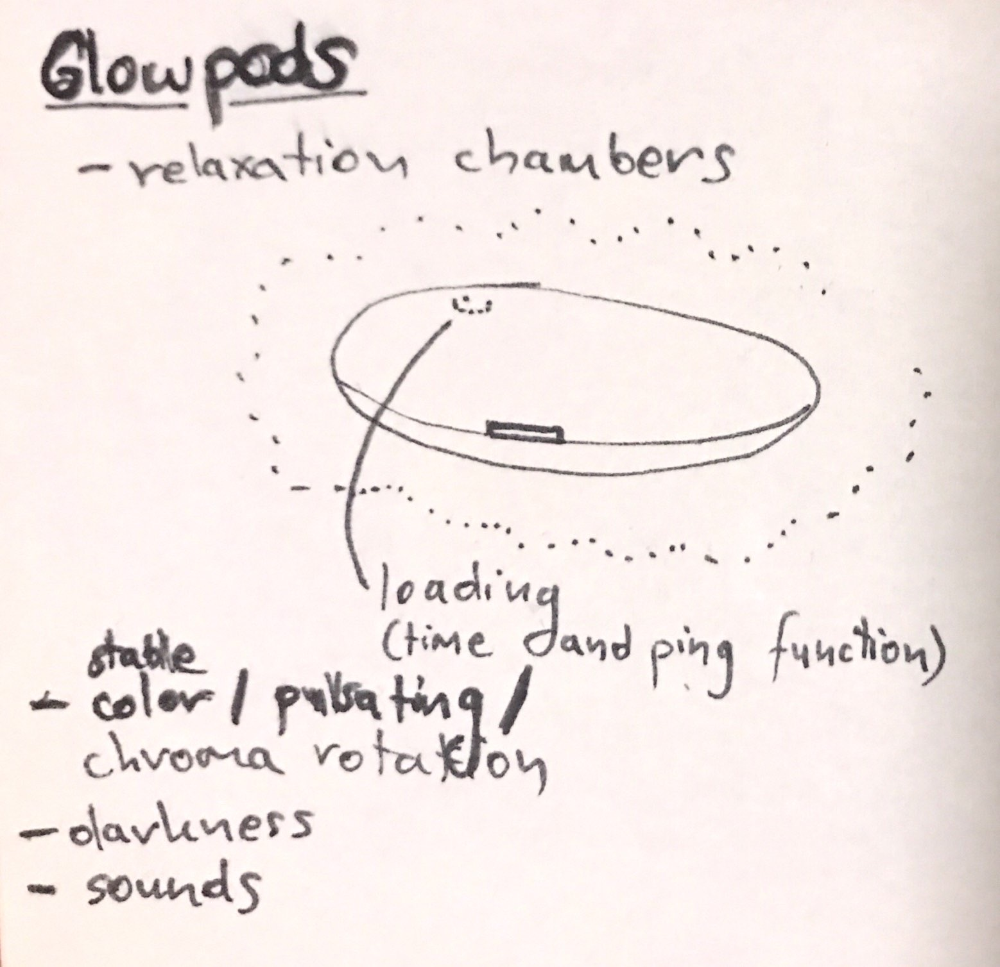

 
# XPod (AHRREC)
XPod is an Advanced Health, Rescue, Relaxation and Experience Chamber (AHRREC). It has multiple functions depending on its intended use (from entertainment through mental health improvement to rescue & locate capabilities).

## GLPD / Glowpod - Advanced Relaxation Chamber
Glowopd is a relaxation chamber tending to all your relaxation needs. It will sooth your senses, allow you to get into "the zone" quickly and efficiently.

- stable color / pulsating / chroma rotation
- darkness mode (isolation mode - perhaps even submersible experience with oxygen mask and salt liquid for sensory deprivation, however that would go more along with the idea of a Healthpod - see below)
- sounds - compose your own audible environment (even add your own sounds) 
- sounds - wide variety of real life and digital blend environments (enhanced enviro, it's like AR but for sound)
- transparent mode - utility function (swipe where you want to "open transparency" or use wipe command to fully clear the outer shell layer).
- mood recognition & mindful mood transitioning
- audiobooks?
- only gentle visual stimulae
- experimental rogue mode: psychedelic trance visuals, be inside your trance (epilepsy warning).

## HLPD / Healthpod/Rescuepod - Advanced Search & Rescue Drone
- idea on a bigger scale is an impenetrable rescuepod that can seek out and take away survivors.
- alert signalling: rapid flashing light (help signal, local+remote activation) allows for locating both in daylight and in complete darkness.
- alert signalling: sound horn (also for the purpose of locating the chamber)
- onboard system has oxygen tanks, GPS tracker, library of psychological tutorials/sessions for an attempt at rapid mental health improvement after an accident (can be silenced by command if victim gets irritated by it.
- voice commands, let the survivor know they are in control of their environment.
- voice commands, AI voice bot, human-like for reassurance, subject age recognition (different AI conversational approaches: kid vs adult)

## SGPD / Storagepod
- more rigid and based on a principle of environmental protection.
- pressurized inner environment
- no oxygen
- cushioned/active amortization
- capacity extenders

## DOGPOD / Military Applications
- graphene coating for deep black stealth
- active camo
- circular vicinity EMP ability
- GPS tracking
- sensor mode (gathering data from the environment)

## XPOD CHARGING STATION

(logistics of recharging and application variety make it a complex problem to solve)

Fill the template structure with your own meaning, don't hesitate to make it yours. Modify the sections, omit or add elements as you please if a need arises. This template is supposed to work for you as fluid outline not as a rigid box - you know what you works best for a certain project, adjust accordingly.

### Credits
+ @mothnode
